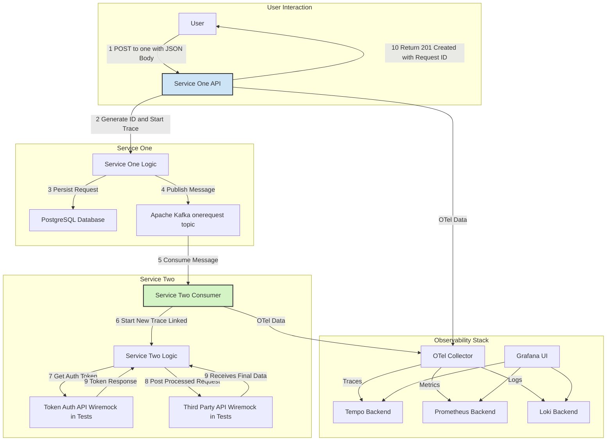

# cruncan - A Reference Backend Architecture

## 1. Project Philosophy & Introduction

`cruncan` is a reference repository designed to encapsulate and demonstrate a wide range of best practices and patterns for building scalable, observable, and maintainable microservices in Go. The project intentionally uses generic, dummy names for its services (`one`, `two`, etc.) to focus purely on the architectural and implementation patterns rather than a specific business domain.

This repository serves as a personal knowledge base and a practical guide, born from experience in senior software engineering roles. It addresses common challenges in backend development, providing clear, working examples of:

-   Clean application structure and dependency injection.
-   Robust inter-service communication via synchronous (REST) and asynchronous (Kafka) methods.
-   Comprehensive observability using the OpenTelemetry (OTel) standard with a full Grafana stack.
-   Advanced testing strategies, from unit tests to full component tests with external dependencies.
-   Secure and efficient database management.
-   Modern Go development practices.

## 2. Architecture & Core Workflow

The project is composed of two primary microservices, `one` and `two`, which communicate asynchronously through Kafka. This setup mimics a common pattern where an initial request is accepted, and further processing is offloaded to a background worker.

### Architecture Diagram (Mermaid)



### End-to-End Workflow Explained

1.  **Request Ingestion (`Service One`):**
    *   A user sends a `POST /one` request with a JSON payload to the `one` service's API endpoint.
    *   The HTTP handler (`one/http/handler.go`) receives the request. An OpenTelemetry trace is started to monitor the entire lifecycle of this request.
    *   A unique, distributed-safe ID is generated for the request using a Twitter Snowflake-based ID generator (`pkg/id/id.go`).
    *   The raw request and its new ID are saved to a PostgreSQL database for persistence and future reference (`one/database/onerequest/repository.go`).
    *   The original request body is published as a message to the `one-request-local` Kafka topic (`pkg/kafka/producer.go`).
    *   A `201 Created` response containing the unique request ID is immediately sent back to the user.

2.  **Asynchronous Processing (`Service Two`):**
    *   The `two` service, running as a background consumer, is subscribed to the `one-request-local` topic.
    *   The Kafka consumer (`pkg/kafka/consumer.go`) polls for new messages. When it receives one, it passes it to the `onerequest.KafkaHandler` (`two/onerequest/kafkahandler.go`).
    *   The handler starts a new OTel span, which is automatically linked to the parent trace from `Service One`, providing a complete, distributed trace.
    *   The handler needs to call a secure third-party API. To do this, it first requests a bearer token from an authentication service using a cached client (`pkg/accesstoken/cache.go`). This prevents re-fetching a token for every single message.
    *   With the access token, it constructs a new request (`model.ThreeRequest`) and sends it to the third-party API (`two/http/client.go`).
    *   The logs and results of this interaction are recorded, and the message processing is complete.

## 3. Directory & Code Structure

The repository is organized into a monorepo structure with clear separation of concerns.

-   `backend/one/`: Contains the source code for the `one` microservice (API, DB interactions, Kafka producer).
    -   `cmd/api/`: The main entry point for the service.
    -   `config/`: Service-specific configuration files.
    -   `database/`: GORM models, repositories, and database migrations. The tracing logic is neatly separated using a Decorator pattern (`repository_tracing.go`).
    -   `http/`: HTTP handlers and their unit tests.
    -   `tests/`: Component/integration tests using Godog.
-   `backend/two/`: Contains the source code for the `two` microservice (Kafka consumer, HTTP client).
    -   `cmd/consumer/`: The main entry point for the consumer application.
    -   `onerequest/`: The Kafka handler logic for processing messages from the `one` service.
    -   `tests/`: Component tests for the Kafka handler, using Wiremock to mock external APIs.
-   `backend/pkg/`: Contains shared packages used across multiple services. This promotes code reuse and consistency.
    -   `accesstoken/`: A reusable, cached client for fetching OAuth2 access tokens.
    -   `config/`: A generic configuration loader using Viper.
    -   `database/gorm/`: A shared GORM client setup.
    -   `id/`: The distributed unique ID generator (Snowflake).
    -   `kafka/`: Abstractions for Kafka producers and consumers using `franz-go`.
    -   `model/`: Shared data models (`OneRequest`, `ThreeRequest`).
    -   `otel/`: The comprehensive OpenTelemetry setup, including helpers for logging, tracing, and metrics.
-   `backend/reference/`: A collection of self-contained code snippets and patterns that are not part of the main application flow but serve as valuable references (e.g., gRPC, JWT validation, distributed retry with Redis).

## 4. Key Concepts & Patterns in Depth

### 4.1. Configuration Management

-   **Mechanism**: The project uses `Viper` for configuration management, facilitated by a generic helper in `pkg/config/config.go`.
-   **Loading**: The `LoadConfigOrPanic[T]` function loads configuration from a YAML file (`config.yaml`) into a strongly-typed Go struct. This provides type safety and easy access to config values.
-   **Flexibility**: The `main.go` of each service demonstrates how to override configuration values at runtime using command-line flags. This is invaluable for running the same application binary in different environments (local, Docker, Kubernetes) without changing the code.

### 4.2. Clean Application Setup (`main.go`)

Each service's `main.go` acts as the composition root. It follows a clean startup sequence:
1.  **Setup Observability**: `otel.Setup()` is called first to ensure tracing and logging are available from the very beginning.
2.  **Load Configuration**: Configuration is loaded from files and flags.
3.  **Initialize Dependencies**: Clients for the database (`gorm`), Kafka, and other services are created.
4.  **Inject Dependencies**: These clients are injected into the application's core logic structs (e.g., repositories, handlers). This follows the principle of Dependency Injection, making the code modular and easy to test.
5.  **Start the Application**: The server or consumer is started.
6.  **Graceful Shutdown**: A `GracefulShutdown` helper (`pkg/util/shutdown.go`) listens for interrupt signals (`CTRL+C`) and ensures that all resources (DB connections, Kafka clients, HTTP servers) are closed cleanly.

### 4.3. Observability (OTel & Grafana Stack)

This is a cornerstone of the project, located in `pkg/otel/`.
-   **Central Setup**: `pkg/otel/setup.go` provides a one-liner `Setup()` function to initialize the entire OTel pipeline (logging, tracing, metrics).
-   **Tracing**:
    -   `pkg/otel/tracer.go` initializes the trace provider, which exports traces to the OTel Collector.
    -   **Context Propagation**: Traces are propagated across service boundaries automatically via Kafka headers and HTTP headers, allowing for complete end-to-end visibility.
    -   **Decorator Pattern**: `one/database/onerequest/repository_tracing.go` is a prime example of adding functionality (tracing) to a component without altering its core code. The `TracingRepository` wraps the real repository, starting and ending a span for each database call.
-   **Logging**:
    -   The project uses Go's standard `slog` library.
    -   `pkg/otel/logger.go` sets up a logger that is integrated with OTel. It automatically adds trace and span IDs to every log message, linking logs directly to traces in Grafana.
    -   `pkg/otel/slog.go` provides a custom `slog.Handler` that injects contextual attributes into logs, ensuring rich, structured logging.
-   **Metrics**:
    -   `pkg/otel/metrics.go` initializes the meter provider.
    -   Custom metrics, like the counters in `one/http/handler.go` (`successPostMeter`, `failedPostMeter`), are used to track key business events. These are exported to Prometheus and can be visualized in Grafana.
-   **Grafana Stack**: The `pkg/otel/grafanastack/` directory contains a `docker-compose.yaml` to spin up a complete local observability suite: Prometheus (metrics), Loki (logs), Tempo (traces), and Grafana (dashboarding).

### 4.4. Database Management

-   **ORM**: The project uses `GORM` (`gorm.io/gorm`) as its Object-Relational Mapper. The shared client setup is in `pkg/database/gorm/db.go`.
-   **Migrations**: Database schema changes are managed using `migrate/migrate`. The migration files are in `one/database/migrations/`. The `one/docker-compose.yml` shows how to run these migrations automatically as a separate container when the environment starts up.
-   **Tracing**: The GORM client is automatically instrumented with the OTel plugin (`gorm.io/plugin/opentelemetry/tracing`), so all database queries appear as spans in the distributed trace.

### 4.5. Asynchronous Communication (Kafka)

-   **Library**: The project uses `twmb/franz-go`, a high-performance, pure Go Kafka client.
-   **Abstractions**: The `pkg/kafka/` directory provides simple, reusable abstractions for `Client`, `Producer`, and `Consumer`.
-   **Producer**: `pkg/kafka/producer.go` offers a straightforward `SendMessage` method.
-   **Consumer**: `pkg/kafka/consumer.go` defines a `ConsumerHandler` interface. This allows any struct that implements `Handle(ctx, msg, topic)` to process messages, cleanly decoupling the Kafka polling logic from the message processing logic.

### 4.6. Unique ID Generation (Snowflake)

-   **Problem**: In a distributed system, generating unique IDs that are also roughly time-sortable is a common challenge.
-   **Solution**: The project uses the Twitter Snowflake algorithm, implemented in `pkg/id/id.go`. A Snowflake ID is a 64-bit integer composed of a timestamp, a machine/node ID, and a sequence number.
-   **Node ID Strategy**: To ensure uniqueness across different service replicas (e.g., multiple pods in Kubernetes), the node ID is cleverly derived from the host's IP address (`nodeIDFromIP`). This avoids the need for a central ID allocation service.

### 4.7. Testing Strategy

The repository showcases a multi-layered testing approach.
-   **Unit Tests**: These are fast-running tests with no external dependencies. `one/http/handler_test.go` is a good example, where the database and Kafka producer are replaced with mock implementations.
-   **Component/Integration Tests**: These tests verify the service's interaction with its external dependencies. They use the `cucumber/godog` framework for Behavior-Driven Development (BDD).
    -   **Gherkin**: Test cases are written in a human-readable Gherkin format (`.feature` files) using `Given`, `When`, `Then` clauses. See `one/tests/httphandler/features/httphandler.feature`.
    -   **Test Setup**: `InitializeSuite` and `InitializeScenario` are used to set up the test environment (e.g., connect to a real test database, start a Kafka consumer).
    -   **Mocking APIs**: For `service two`'s tests, external HTTP services are mocked using `Wiremock` (`two/tests/onerequest/kafkahandler_test.go`). The test sets up stub rules on the Wiremock server to define expected requests and their corresponding responses.
    -   **Real Dependencies**: For `service one`'s tests, the tests interact with real Kafka and PostgreSQL instances managed by Docker Compose, providing a high-fidelity testing environment.

### 4.8. Reference Patterns

The `backend/reference/` directory contains valuable, self-contained examples of other important patterns.
-   **Distributed Retry**: `reference/retry/` demonstrates a robust pattern for a retry job. It uses **Redis and Redsync** for distributed locking, ensuring that even with multiple replicas of the retry job running, a failed transaction is only processed once.
-   **gRPC**: `reference/grpc/` provides a complete example of a gRPC client and server, including how to generate code from a `.proto` file.
-   **JWT Validation**: `reference/auth/jwt/` shows how to implement middleware to validate a JWT token, including fetching public keys from a JWKS URL and caching them.
-   **CronJob**: `reference/cronjob/` contains skeleton YAML for a Kubernetes CronJob, useful for scheduling periodic tasks like database cleanup.

## 5. Getting Started & Running the Project

### Prerequisites

-   Docker and Docker Compose
-   Go (version 1.22 or later)
-   `make`

### Step-by-Step Instructions

1.  **Start Shared Infrastructure**:
    The core infrastructure (Docker network, Kafka, Zookeeper) is required by both services.
    ```sh
    # In the root `backend/` directory
    make network-up
    make kafka-up
    ```
    You can check the Kafka UI (AKHQ) at `http://localhost:8080`.

2.  **Start Service One and its Database**:
    ```sh
    # In the root `backend/` directory
    make one-up
    ```
    This will start a PostgreSQL container and a migration container that sets up the `request` table. The `one` service itself is not started by this command; it's meant to be run locally from your IDE or terminal.

3.  **Run Service One API**:
    Navigate to the service directory and run the main application.
    ```sh
    cd backend/one
    go run cmd/api/main.go
    ```
    The API is now running on `http://127.0.0.1:8099`.

4.  **Run Service Two Consumer**:
    Service `two` has its own `docker-compose.yml` that includes its dependencies (like Wiremock for tests).
    ```sh
    # In the `backend/two/` directory
    docker compose up --build -d
    ```
    The consumer is now running and listening for messages on the Kafka topic.

5.  **Run the Tests**:
    To run the component tests for a service, navigate to its directory and use the Go test command.
    ```sh
    # For service one
    cd backend/one
    go test -v ./...

    # For service two (ensure its docker-compose stack is up)
    cd backend/two
    go test -v ./...
    ```

6.  **Explore Observability**:
    To see the OTel integration in action, start the Grafana stack.
    ```sh
    # In backend/pkg/otel/grafanastack/
    docker compose up -d
    ```
    -   Access Grafana at `http://localhost:3000` (admin/admin).
    -   Configure your local environment to send OTel data to the collector by setting these environment variables before running `service one` or `service two` locally:
        ```sh
        export OTEL_EXPORTER_OTLP_INSECURE=true
        export OTEL_SERVICE_NAME=my-local-app
        export OTEL_EXPORTER_OTLP_ENDPOINT=http://127.0.0.1:4318
        export OTEL_EXPORTER_OTLP_PROTOCOL=http/protobuf
        ```
    -   Now, when you send a request to `service one`, you can explore the logs, traces, and metrics in Grafana.
